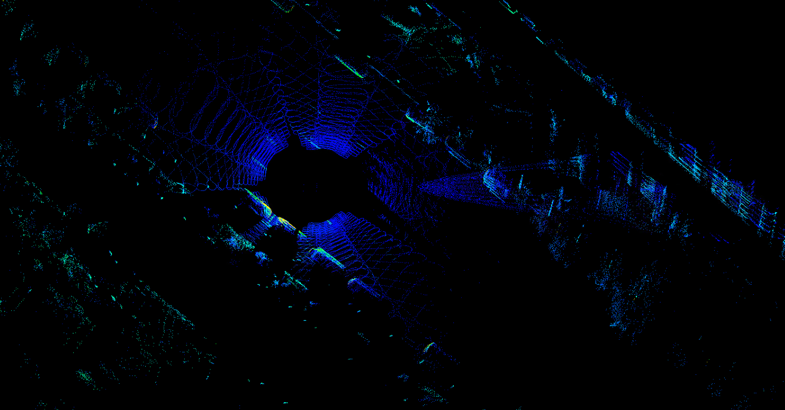
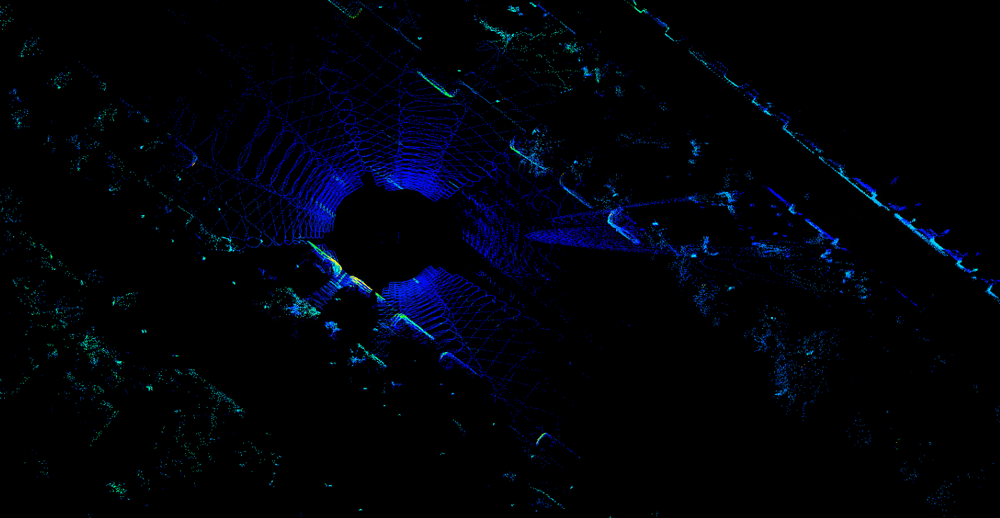

# Livox Cloud Undistortion ROS2

[Livox Cloud Undistortion](https://github.com/Livox-SDK/livox_cloud_undistortion) for ROS 2.

This project is used for lidar point cloud undistortion. During the recording process, the lidar point cloud has naturally the distortion due to the affect of ego motion. Using the interpolation of ego motion, the distortion can be eliminated by transforming each point to the frame head or tail coordinate. Figures below show an example of undistortion.

<div align="center">
<br>
Figure 1. before<br>
<br>
Figure 2. after
</div>

## Topic

Subscribed topic:

- **/livox/points** &emsp;(`sensor_msgs::msg::PointCloud2`)
- **/livox/imu** &emsp;(`sensor_msgs::msg::Imu`)

Published topic:

- **/livox_first_point** &emsp;(`sensor_msgs::msg::PointCloud2`)
- **/livox_undistort** &emsp;(`sensor_msgs::msg::PointCloud2`)
- **/livox_origin** &emsp;(`sensor_msgs::msg::PointCloud2`)

## Dependency

* ROS2
* PCL
* Eigen3
* Livox-SDK2
* livox_ros_driver2

## Build

```
colcon build
```

## Run

```
. install/setup.bash
ros2 launch livox_undistortion livox_undistortion.launch
```

## Interface introduction

The member function UndistortPcl of the class ImuProcess defined in the header data_process.h, is used for the point cloud undistortion. The parameter Sophus::SE3d Tbe is the egomotion. If you can provide ego motion, just call this function. Otherwise, the function Process (also a member function of the class ImuProcess) is anothor choice, which uses the IMU data to deskew the rotation distortion.

## Other work

This project aims to eliminate ego motion distortion. For target motion distortion correction, we recommend reading this work for reference. 
[Lidar with Velocity](https://github.com/ISEE-Technology/lidar-with-velocity)
